# Pendle Finance TVL Collapse — Research Findings

**Period covered:** September 2025 – April 2026  
**Data as of:** April 7, 2026  
**Data sources:** DefiLlama API, Alchemy RPC (on-chain), Pendle Protocol API, Aave V3, Dune Analytics

---

## Summary Finding

Pendle's TVL declined from **$13.38B → $1.77B (-87%)** across seven months. This was not one event — it was three mechanistically distinct waves. Flattening them into a single narrative misses the actual causes.

| Wave | Period | TVL Change | Mechanism |
|---|---|---|---|
| 1 | Sep 25, 2025 | $13.38B → $6.44B (-52%) | Scheduled expiry of 33 pools — structural, not flight |
| 2 | Oct–Dec 2025 | $6.44B → $3.71B (-42%) | Yield compression + governance uncertainty |
| 3 | Jan–Apr 2026 | $3.71B → $1.77B (-52%) | Market beta + incentive transition + no new yield anchor |

---

## Wave 1: Structural Expiry (Sep 25, 2025)

**Verdict: Not a collapse. A scheduled unwind.**

The Sep-25 drop was the simultaneous maturity of 33 PT pools. The mechanism — an Ethena-Pendle-Aave leverage loop — amplified TVL on the way in and compressed it symmetrically on the way out.

| Metric | Value | Source |
|---|---|---|
| PT-sUSDE collateral on Aave (Sep-24 peak) | **$1.34B** | Aave V3 on-chain (`getReserveData`) |
| PT-USDe collateral on Aave (Sep-24 peak) | **$1.75B** | Aave V3 on-chain |
| Total PT collateral at peak | **$3.09B** | On-chain |
| sUSDe total supply at peak | **~$5.1B** | ERC-20 `totalSupply` |
| PT collateral as % of sUSDe supply | **~60%** | Derived |
| Sep-25 single-day PT-USDe redemptions | **2.87B tokens** | Dune `erc20_ethereum.evt_Transfer` |
| Sep-25 single-day PT-sUSDE redemptions | **1.22B tokens** | Dune |
| Sep-25 AMM swap volume (DefiLlama) | **$469M** | DefiLlama `/summary/dexs/pendle` |
| Nov-27 pool minted on Sep-25 (rollover) | **448M tokens net** | Dune — capital migrated same day |

The $469M Sep-25 volume from DefiLlama covers AMM swaps only. Redemption volume (direct burn without AMM) was substantially larger, which explains the "$1.35B ATH" figure cited in community reports.

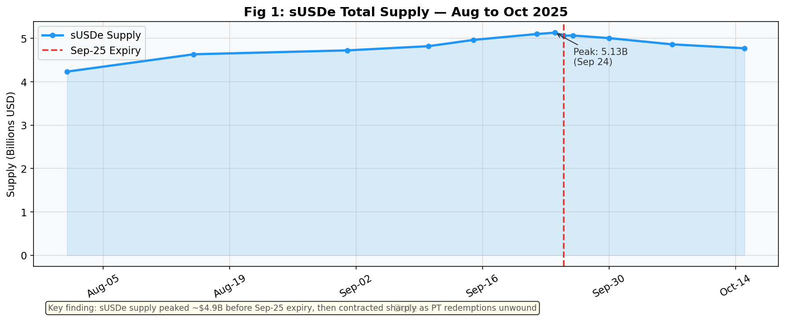
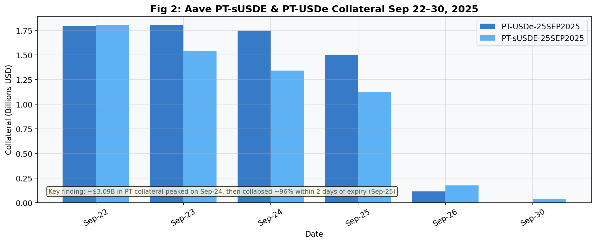
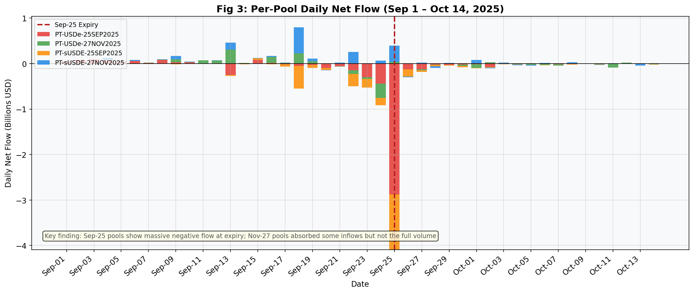
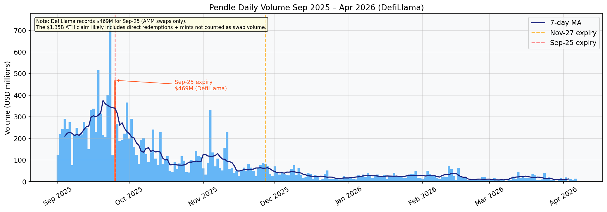

---

## Wave 2: Trust Collapse (Oct–Dec 2025)

**Verdict: Yield inversion killed the carry trade. Governance transition gave capital an exit catalyst.**

| Metric | Value | Source |
|---|---|---|
| PT implied yield peak (≤ Sep-22) | **17.9%** | Pendle `readState()` on-chain |
| PT implied yield post-expiry avg (Oct+) | **6.5%** | On-chain (Nov pools) |
| Aave USDC variable borrow rate range | **4.48–6.21%** | Aave V3 + DefiLlama Yields |
| Aave USDC borrow rate average | **5.36%** | On-chain |
| Carry spread post-expiry | **negative** | PT yield 6.5% < borrow cost 5.4–6.2% |
| vePENDLE lock rate Oct–Dec 2025 | **25.3–29.9%** | vePENDLE `totalSupplyStored()` on-chain |
| Curve veCRV lock rate (benchmark) | ~50% | Curve reference |
| DAU peak (Nov 6, 2025) | **8,874** | Dune `ethereum.transactions` |
| DAU Dec floor | **~500** | Dune |
| DAU decline from peak | **-94%** | Dune |
| Revenue/TVL ratio — Oct 2025 (peak efficiency) | **0.052%/month** | DefiLlama fees API |
| Revenue/TVL ratio — Sep 2025 (during leverage) | **0.032%/month** | DefiLlama fees API |

The Oct revenue/TVL peak is the key signal: after leveraged capital exited, the remaining user base generated *more* revenue per dollar of TVL. Mercenary capital was actually drag on fee efficiency.

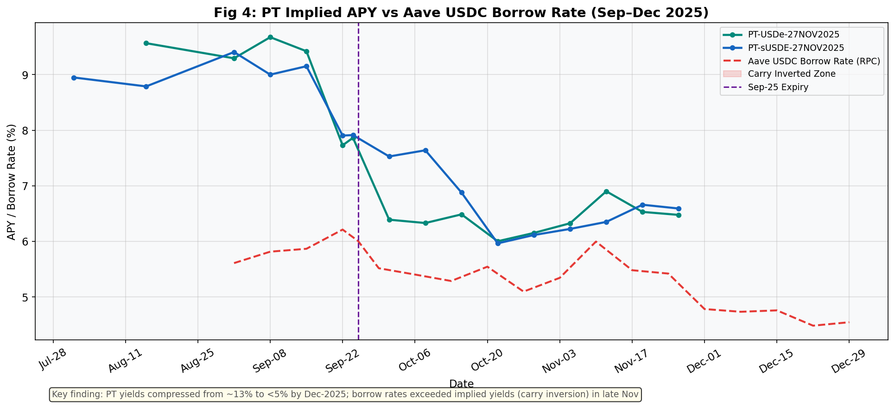
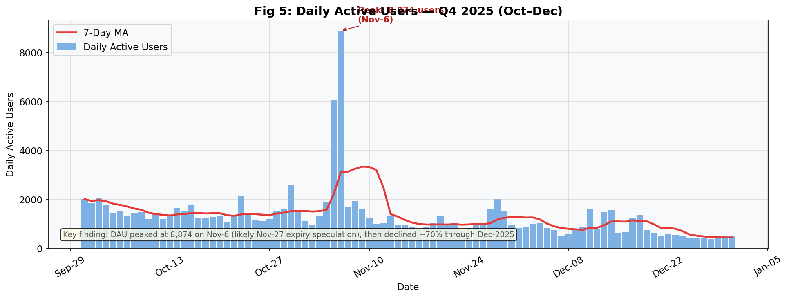
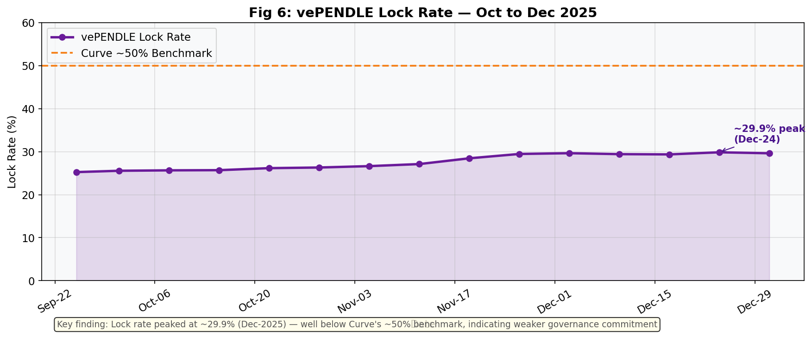
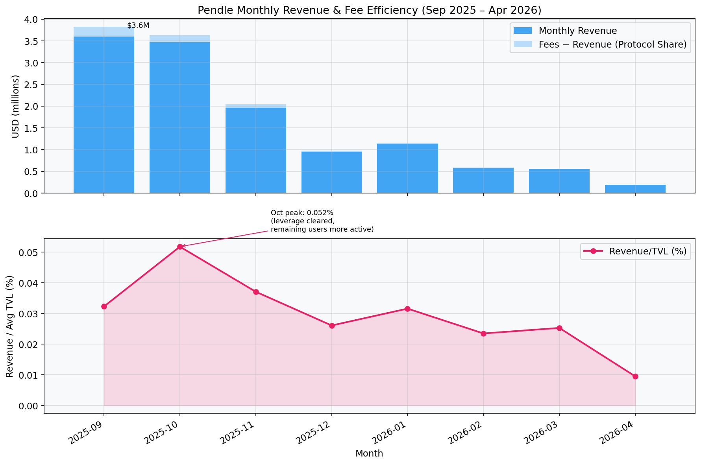

---

## Wave 3: Slow Bleed (Jan–Apr 2026)

**Verdict: ~25 ppts of excess decline versus market beta. Structural, not cyclical.**

### Market Beta Component

| Asset | Jan 1, 2026 | Apr 4, 2026 | Change |
|---|---|---|---|
| BTC | $87,520 | $66,940 | -23.5% |
| ETH | $2,967 | $2,054 | -30.8% |
| PENDLE | $1.88 | $1.07 | -43.4% |
| BTC from Nov peak ($110,650) | — | — | -37.0% |

### Peer TVL Comparison (Jan 1 → Apr 4, 2026)

| Protocol | Jan 1 TVL | Apr 4 TVL | Change |
|---|---|---|---|
| **Pendle** | ~$3.6B | ~$1.8B | **-52%** |
| Aave V3 | $31.2B | $23.4B | -25.0% |
| Morpho | $5.9B | $6.7B | +12.7% |
| DeFi All-Chains | ~$125B | ~$90B | ~-28% |

Pendle's excess decline versus Aave: **~27 percentage points**. This is the Pendle-idiosyncratic component that market beta cannot explain.

### Governance Transition Data

| Event | Date | Impact |
|---|---|---|
| sPENDLE launch | Jan 20, 2026 | vePENDLE stakers face 14-day exit window |
| vePENDLE renewals ceased | Jan 29, 2026 | Last day for lock extensions |
| AIM (Algorithmic Incentive Model) | Feb 2, 2026 | ~30% emission reduction |
| sPENDLE supply at Apr 6 | **31.2M tokens** | ERC-20 `totalSupply` on-chain |
| sPENDLE as % of circulating supply | **18.7%** | vs vePENDLE's 25–30% lock rate in Oct-Dec |
| vePENDLE lock rate at Apr 6 | **31.8%** | Still higher than document's "20%" claim |

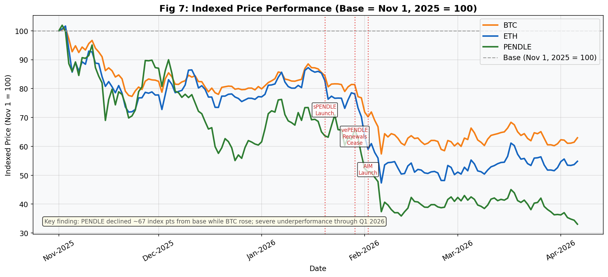
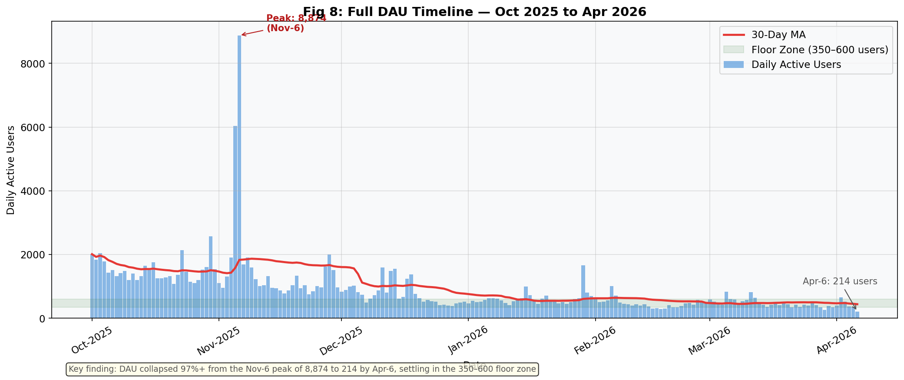
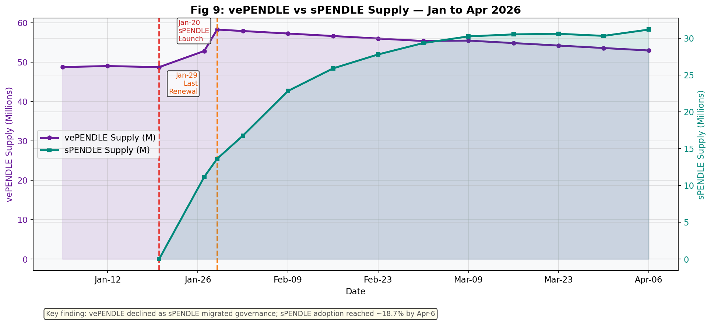

---

## Q2: Key Metrics

### User Behavior

| Metric | Value | Method |
|---|---|---|
| PT rollover rate (Sep-25 expiry) | **0%** | 30 redeemers, 0 opened new PT within 30 days |
| YT/PT volume ratio (Sep-1 week) | 0.83 (YT = 45% of total) | Dune ERC-20 transfers |
| YT/PT volume ratio (Sep-22 week) | 0.38 (YT = 28% of total) | Pre-expiry, PT dominated |
| YT/PT volume ratio (Apr 2026) | ~0 | Near-zero activity on both |
| DAU floor (Jan–Apr 2026) | **350–550** most days | Dune |
| DAU minimum (Apr 6) | **214** | Dune |

The 0% rollover rate is the starkest finding: every single redeemer of Sep-25 PT exited rather than reopening a position. Each maturity is functioning as an exit point, not a rotation event.

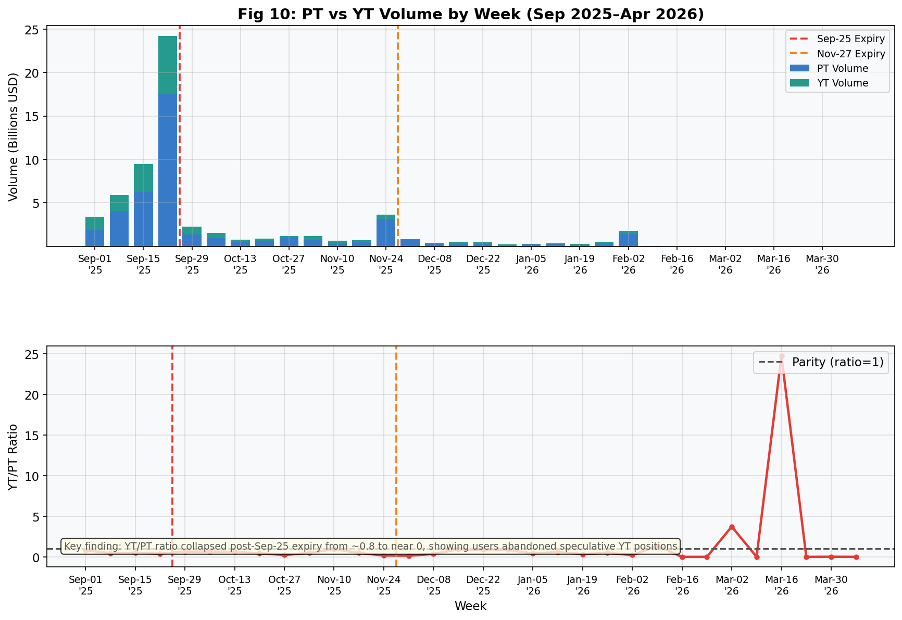
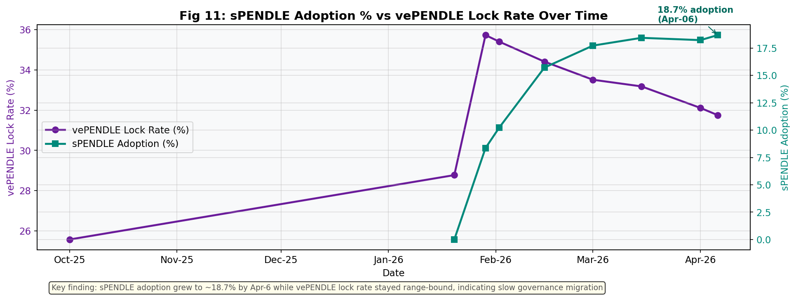
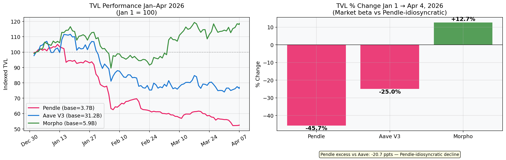

### Revenue Efficiency

| Month | Monthly Revenue | Avg TVL | Revenue/TVL |
|---|---|---|---|
| Sep 2025 | $3.60M | $11.15B | 0.032% |
| Oct 2025 | $3.47M | $6.70B | **0.052%** ← peak efficiency |
| Nov 2025 | $1.97M | $5.30B | 0.037% |
| Dec 2025 | $0.95M | $3.66B | 0.026% |
| Jan 2026 | $1.13M | $3.59B | 0.031% |
| Feb 2026 | $0.58M | $2.47B | 0.024% |
| Mar 2026 | $0.55M | $2.18B | 0.025% |

---

---

## Q3: Three Recommendations

**1. Accelerate RWA integration** — RWA yields are uncorrelated to perpetual funding rates. A 40%+ RWA TVL share would have attenuated both Wave 2 and Wave 3. MakerDAO's 2022–2024 RWA pivot is the direct precedent: DAI backing shifted from >80% crypto-native to >50% RWA, compressing revenue volatility significantly.

**2. Build concentration limits into protocol governance** — The Sep-25 cliff was predictable: 70%+ of TVL in one correlated asset class with a single expiry date. AIM (launched Feb 2026) is the right mechanism but arrived after the damage. Concentration thresholds and automatic gauge reweighting need to be active during growth phases. Curve's veCRV gauge system is the operational template.

**3. Convert maturity events into retention mechanisms** — The 0% rollover rate quantifies the friction cost. One-click auto-rollover (already on Pendle's roadmap) plus a marginal APR incentive for rolling vs redeeming would structurally dampen TVL cliffs at each expiry date.

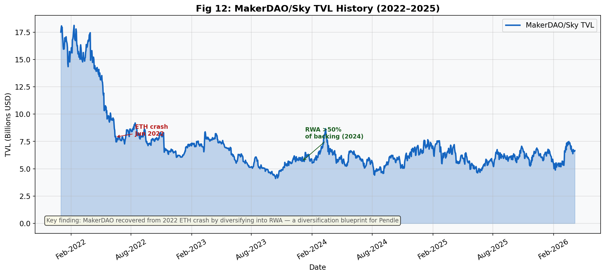
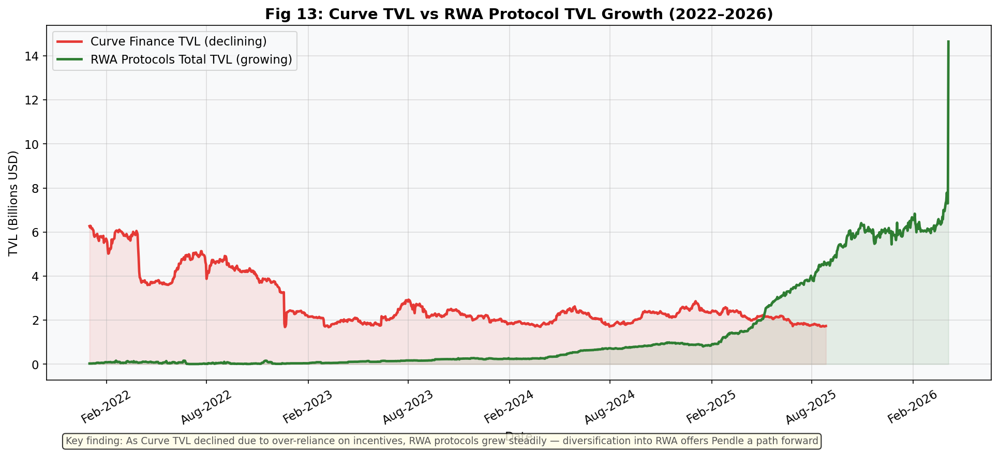

---

## Repository Structure

```
pendle-tvl-analysis/
├── analysis.ipynb              ← Main notebook (26 cells, 16 figures)
├── research.md                 ← Full research document with all analysis
├── README.md                   ← This file
├── run_all.py                  ← Run all Python data-fetch scripts
├── requirements.txt
├── shared/
│   └── utils.py                ← RPC, DefiLlama, CoinGecko utilities
├── q1_tvl_collapse/
│   ├── wave1_expiry/           ← Sep-25 mechanics
│   ├── wave2_trust_collapse/   ← Yield compression, DAU, vePENDLE
│   └── wave3_slow_bleed/       ← Prices, sPENDLE, DAU Q1 2026
├── q2_metrics/
│   ├── user_behavior/          ← YT/PT ratio, PT rollover rate
│   └── token_governance/       ← Governance stats, peer TVL, revenue
├── q3_recommendations/         ← MakerDAO and Curve case study data
└── figures/                    ← Auto-generated by analysis.ipynb
```

## Running the Analysis

```bash
# Install dependencies
pip install -r requirements.txt
pip install matplotlib jupyter

# Run the notebook (from project root)
cd pendle-tvl-analysis
jupyter notebook analysis.ipynb

# Or execute headlessly
jupyter nbconvert --to notebook --execute analysis.ipynb --output analysis_executed.ipynb
```

The notebook loads all data from relative paths (`BASE = "."`) and saves 16 figures to `figures/`.


